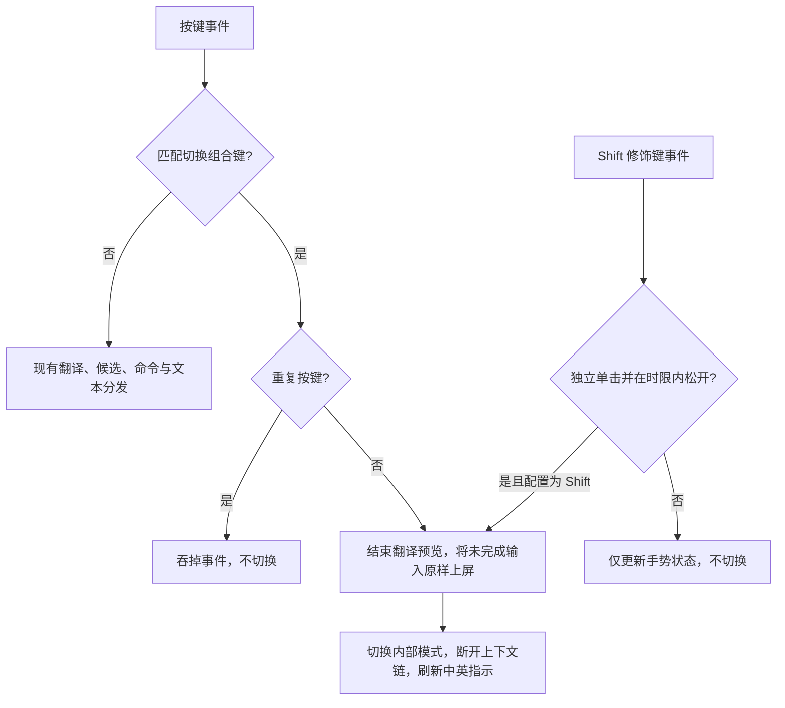

# macOS 中英文切换

## 背景与概念

原先中英文完全跟随 Caps Lock。新增可录制的组合键，用户可以保留系统的键盘习惯。该功能属于 macOS 输入事件适配，不改变 Core 的拼音、排序或词库逻辑；Windows 的 Shift 切换行为不变。

- `mode_switch`：`[shortcut]` 配置项，缺省 `shift`。`ModeSwitch` 支持单击 Shift 与旧版 `control+option+m` 等组合键写法；旧配置显式设置的组合键保持不变。设置页录制、配置文件热加载、恢复默认共用已有配置通路。
- `InputMode`：进程内模式偏移，与 Caps Lock 状态异或得到实际中英文。跨输入框保留，不写入配置，不操作硬件锁定状态。
- Core 的 `english_mode`：控制当前是否使用英文候选，与输入法的中英文状态不同；英文纯直通时它仍为 false。

## 规则与流程

切换键接受单击 Shift 或修饰键加字母，不抢数字候选；不得与翻译选区组合键相同。设置页拒绝冲突，手工写入的冲突或数字组合在运行时禁用，并显示提示。无效 TOML 仍沿用上一份有效配置。

单击 Shift 在 `FlagsChanged` 的松开事件识别：同一左 / 右 Shift 在 500 ms 内按下再松开才触发；中间有 KeyDown、其他修饰键变化、双 Shift 重叠或鼠标动作即取消。失焦、激活、结束组句时清空待确认手势。`ShiftTap` 同时用于录制器和运行时，防止录得进去却触发不了。

控制器的 `recognizedEvents:` 订阅 KeyDown、FlagsChanged 与三种鼠标按下事件。扩展掩码后 IMK 不再提供仅 KeyDown 时的默认鼠标收尾，因此鼠标按下会取消 Shift 手势、结束翻译预览并原样上屏组句，再把点击交回应用。

组合键优先于翻译预览和普通命令键；不匹配时走原有逻辑。中文模式下若 Caps Lock 仍亮着，去掉它造成的大写，保留事件中的 Shift 临时大写；英文模式同样按事件中的 Shift 决定大小写。

## 实现与验证

- `imk/controller/event.rs`：事件分发；控制器组句逻辑留在 `controller/mod.rs`。
- `imk/mode.rs` 与 `modifiers.rs`：纯状态模型与系统状态读取，输入和菜单栏使用同一入口。
- `ShortcutConfig::mode_switch_keys`：运行时校验，旧配置缺字段沿用默认值。
- 回归覆盖配置默认值、保存读取、冲突与数字键禁用、组合键与 Caps Lock 交替切换。
- Shift 回归覆盖左右键松开、组合输入、双 Shift、长按、鼠标取消与会话重置；配置测试先复现旧版拒绝 `shift` 后验证修复。
- 真实输入须用已安装的 `.app` 测试：中文组句后切英文、英文组词后切中文、长按切换键、Caps Lock 亮着时切回中文、Shift 大写及不同应用之间切换。
- 本次配置与手势测试通过，更新已安装；独立 NSTextView 的合成事件测试未观察到中英输出变化，不能作为端到端通过证据，真实键盘切换仍待用户确认。

微信 / 企业微信切换输入源导致宿主应用崩溃的问题独立于中英切换，根因为应用私有键盘缓存陈旧；复现证据与修复见 [输入源缓存](../notes/input-source-cache.md)。
